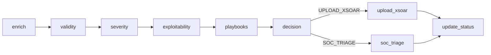

# A2A Security Framework (Agents→Automation)

End‑to‑end, LLM‑assisted SOC orchestration scaffold built around **LangGraph** + **Pydantic** types and a clean separation of concerns (domains, agents, tools, and graph). This README walks through the repository structure and documents **every script and function** so you can customize it to your stack (SIEM/EDR/CMDB, XSOAR, Slack/PagerDuty, etc.).

---

## Quick Start

### Prerequisites
- **Python** 3.11+ (3.12 recommended)
- (For the Streamlit UI) **Graphviz** runtime
  - macOS: `brew install graphviz`
  - Ubuntu/Debian: `sudo apt-get install graphviz`
  - Windows (choco): `choco install graphviz`
- **OpenAI API key** (or swap in your LLM provider in `src/agents.py`)

### Setup
```bash
git clone <your-repo-url>
cd security_framework_a2a
python -m venv .venv
source .venv/bin/activate   # Windows: .venv\Scripts\activate
pip install -r requirements.txt
```

Create a `.env` with your secrets (at minimum the LLM key):
```ini
# .env
OPENAI_API_KEY=sk-...
# Optional overrides
A2A_POLICY=./config.yaml           # path to policy file
A2A_OBS_LOG=./a2a_observability.log
```

### Run the CLI demo
```bash
python src/run_demo.py
```
This loads a sample `Alert`, runs the graph once, and prints the **decision**, **status**, **chosen playbooks**, and an **audit log**.

### Run the Streamlit UI
```bash
streamlit run src/streamlit_app.py
```
- Choose **Form** or **JSON** to input an alert
- Pick **Native streaming (parallel)** or **Sequential stepper**
- Watch node statuses, metrics, enrichment, and timeline update live
- Uses an on‑disk SQLite checkpointer if available (falls back to memory)

---

## Repository Layout

```
security_framework_a2a/
    .env
    .gitignore
    a2a_observability.log
    config.yaml
    requirements.txt
    src/
        agents.py
        config.py
        domains.py
        graph.py
        run_demo.py
        streamlit_app.py
        tools.py
```

- **`config.yaml`** — Policy thresholds & future playbook rules
- **`a2a_observability.log`** — JSONL events emitted during runs
- **`requirements.txt`** — Pinned Python deps (LangChain, LangGraph, Streamlit, etc.)
- **`src/`** — All code: typed domains, LLM agents, orchestration graph, UI, and integration stubs

---

## Overall Flow (Graph Topology)

High‑level pipeline (left→right), with the final decision branching to automation or human triage:



The Streamlit app renders a Graphviz version of the same topology and streams node‑level updates.

---

## `src/domains.py` — Typed Domain Objects
Strict, LLM‑friendly Pydantic models that define the **contract** between agents and the graph.

### `class Indicator`
- **type**: one of `ip | domain | hash | url | email | user | process | file | host`
- **value**: indicator string
- **context**: optional human hint (e.g., *“tor exit”*, *“prod host”*)

### `class Alert`
- **id**: unique alert id (e.g., `ALRT-1001`)
- **source**: default `"SIEM"`
- **title**, **description**: human description
- **indicators**: list of `Indicator`
- **created_at**: timestamp (default now)

### `class ValidityScore`
- **label**: `"False Positive" | "False Negative" | "True Positive" | "True Negative"`
- **likelihood**: `0..1` belief that alert is real (**TP**)
- **rationale**: brief explanation

### `class SeverityScore`
- **level**: `1 | 2 | 3` (map to your program’s levels)
- **impact**: `"Low" | "Medium" | "High"`
- **rationale**

### `class ExploitabilityScore`
- **level**: `"Not Exploitable" | "Low" | "Medium" | "Critical"`
- **likelihood**: `0..1` belief the condition can be exploited
- **rationale**

### `class PlaybookChoice`
- **names**: list of playbook names to run (e.g., `Contain_Endpoint`, `Reset_Creds`)
- **rationale**

### `class Decision`
- **soc_attention**: boolean gate telling if the incident deserves automation
- **path**: `"UPLOAD_XSOAR" | "SOC_TRIAGE"`
- **rationale**: short justification

### `class ActionLog`
- **at**: timestamp
- **event**: event key (e.g., `enriched`, `xsoar_uploaded`)
- **details**: JSON blob with any fields you add (host, counts, api responses)

### `class SOCState (TypedDict)` — Shared Graph State
- **alert: Alert** *(input)*
- **enrichment: dict** *(output of `enrich_node`)*
- **validity: ValidityScore**
- **severity: SeverityScore**
- **exploitability: ExploitabilityScore**
- **playbooks: PlaybookChoice**
- **decision: Decision**
- **status: str** (human‑readable status summary)
- **logs: list[ActionLog]** — **reducer is `operator.add`** to support parallel node appends

> These types are the **single source of truth** for all LLM structured outputs and node IO.

---

## `src/config.py` & `config.yaml` — Policy Loader & Thresholds

- `load_policy()` loads YAML from `A2A_POLICY` env var or the repo‑root `config.yaml`, merges onto internal defaults:
  - `thresholds.validity_tp_min` (default **0.60** unless overridden by `config.yaml`)
  - `thresholds.severity_min` (default **2**)
  - `thresholds.exploit_levels_escalate` (default **["Medium", "Critical"]**)
  - future: `playbook_rules` mapping

Example `config.yaml` (in repo):
```yaml
thresholds:
  validity_tp_min: 0.65
  severity_min: 2
  exploit_levels_escalate: ["Medium", "Critical"]
# playbook_rules: []
```

---

## `src/agents.py` — LLM Agents
Each agent uses a shared LLM client and returns a **typed** object from `domains.py`.

### `get_llm()`
Returns a preconfigured `ChatOpenAI` client (`model="gpt-4o-mini"`, `temperature=0`). Swap to your provider if needed.

### `validity_agent(alert: Alert, enrichment: dict) -> ValidityScore`
- Prompt asks the model to determine whether the alert is real
- Returns **label**, **likelihood**, and **rationale** as a `ValidityScore`

### `severity_agent(alert: Alert, enrichment: dict) -> SeverityScore`
- Scores **business/technical impact** (1–3 & Low/Medium/High) with a short justification

### `exploitability_agent(alert: Alert, enrichment: dict) -> ExploitabilityScore`
- Estimates exploitability and likelihood (0–1) with rationale

### `playbook_agent(alert: Alert, enrichment: dict, scores: ...) -> PlaybookChoice`
- Chooses playbooks to run based on observed context & scores (extensible with future `playbook_rules`)

### `decision_agent(validity, severity, exploitability, policy=None) -> Decision`
- Applies a **deterministic gate** using thresholds from `load_policy()`
  - Escalate when `validity.likelihood ≥ validity_tp_min` **and** (`severity.level ≥ severity_min` **or** `exploitability.level ∈ exploit_levels_escalate`)
- Calls the LLM to produce a concise **rationale** and **path** (`UPLOAD_XSOAR` vs `SOC_TRIAGE`)

> All agent prompts are created with `ChatPromptTemplate` and use `with_structured_output(...)` to guarantee schema.

---

## `src/tools.py` — Integration Stubs
Replace these stubs with your real systems.

### `search_internal_data(query: str) -> list[dict]`
Call your SIEM/EDR/CMDB/ticketing/asset DB. Stub returns example EDR/CMDB hits.

### `search_external_osint(query: str) -> list[dict]`
Hook to VirusTotal, GreyNoise, AbuseIPDB, etc. Stub returns canned examples.

### `@dataclass class XSOARClient`
- `upload_incident(payload: dict) -> dict` — POST to your XSOAR/Demisto
- `update_status(incident_id: str, status: str) -> dict`

### `notify_soc(payload: dict) -> dict`
Send to your human triage channel: Slack, PagerDuty, email, etc.

---

## `src/graph.py` — Orchestration (LangGraph)
Defines graph **nodes**, **edges**, observability, and build helpers.

### Observability
- `_emit_observable(event, **details)` appends JSON lines to `A2A_OBS_LOG` (default `a2a_observability.log`)
- `log_event(event, **details) -> list[ActionLog]` produces a delta list for the **reducer** to append
- `log(state, event, **details) -> list[ActionLog]` also emits to the file and returns the updated list

### Node implementations
- `enrich_node(state) -> state_delta`
  - For each `Indicator`, queries `search_internal_data` and OSINT for net IOCs
  - Returns `{ "enrichment": {internal, external}, "logs": [...] }`

- `validity_node(state) -> state_delta`
  - Calls `validity_agent`; returns `{ "validity": ValidityScore, "logs": [...] }`

- `severity_node(state) -> state_delta`
  - Calls `severity_agent`; returns `{ "severity": SeverityScore, "logs": [...] }`

- `exploitability_node(state) -> state_delta`
  - Calls `exploitability_agent`; returns `{ "exploitability": ExploitabilityScore, "logs": [...] }`

- `playbooks_node(state) -> state_delta`
  - Calls `playbook_agent`; returns `{ "playbooks": PlaybookChoice, "logs": [...] }`

- `decision_node(state) -> state_delta`
  - Calls `decision_agent`; returns `{ "decision": Decision, "logs": [...] }`

- `upload_xsoar_node(state) -> state_delta`
  - Builds a minimal incident payload and calls `XSOARClient.upload_incident`
  - Returns status and `xsoar_uploaded` log

- `soc_triage_node(state) -> state_delta`
  - Notifies human queue via `notify_soc`
  - Returns status and `triage_notified` log

- `update_status_node(state) -> state_delta`
  - If path was `UPLOAD_XSOAR`, updates status via `XSOARClient.update_status`
  - Else no‑op, logs `status_noop`

### Build & topology helpers
- `build_graph(parallel: bool = True, checkpointer=None)`
  - Registers nodes, wires edges, configures START/END, and compiles the app
  - Pass a `SqliteSaver`/`MemorySaver` to enable checkpointing & streaming
- `describe_topology()` returns `{ nodes, edges }` for visualization

---

## `src/run_demo.py` — Minimal CLI Runner
- Loads `.env`
- Creates an example `Alert` (ip/host/user)
- `app = build_graph()` then `app.invoke({"alert": alert, "logs": []})`
- Prints the resulting `decision`, `status`, `playbooks`, and the timeline of `logs`

---

## `src/streamlit_app.py` — Interactive UI
A compact UI to explore the graph live.

### Key pieces
- **Graphviz diagram** with node coloring based on status (pending/running/done/branch)
- **Two run modes**
  - **Native streaming (parallel)**: uses LangGraph streaming to update the UI as deltas arrive
  - **Sequential stepper**: runs each node with a user‑controlled delay — helpful for demoing
- **Checkpointing**
  - Tries `langgraph.checkpoint.sqlite.SqliteSaver("a2a_checkpoints.sqlite")`
  - Falls back to `MemorySaver` if SQLite is unavailable
  - Enter a **Thread ID** to reuse/inspect a previous run’s state
- **Sidebar**
  - Input mode: **Form** or **JSON** (raw `Alert` JSON)
  - Policy viewer (current thresholds from `config.yaml`)
- **Panels**
  - Metrics: validity/severity/exploitability/playbooks/decision
  - Enrichment (internal & external hits)
  - Timeline of `ActionLog` events
  - Final state + downloadable JSON snapshot

---

## Configuration & Environment
- **LLM**: controlled in `agents.get_llm()` — swap provider/model or add retries/timeouts
- **Policy**: edit `config.yaml` or set `A2A_POLICY=/path/to/your.yaml`
- **Observability**: set `A2A_OBS_LOG=/path/to/file.jsonl`
- **Secrets**: put keys in `.env` (dotenv is loaded in CLI & UI)

---

## Extending the Framework
1. **Wire real data sources** in `tools.py` (SIEM/EDR/CMDB/ticketing/OSINT)
2. **Harden prompts** or add **guardrails** (schema validators, unit tests)
3. **Add rules** (`playbook_rules` in `config.yaml`) to enforce hard decisions
4. **Introduce new nodes** (e.g., `contain`, `notify_owner`) — add in `graph.py`, then include in the UI’s `NODES`
5. **Swap the LLM** (e.g., on‑prem, Azure OpenAI, Bedrock, etc.)

---

## Example: Alert JSON
```json
{
  "id": "ALRT-1001",
  "title": "Outbound connection to known brute-force IP",
  "description": "FW logs show repeated egress to suspicious IP by host srv-42.",
  "indicators": [
    { "type": "ip",   "value": "203.0.113.55" },
    { "type": "host", "value": "srv-42" },
    { "type": "user", "value": "svc-backup" }
  ]
}
```

---

## Troubleshooting
- **Graphviz not found** → install it and restart Streamlit (see prerequisites)
- **No streaming/graph errors** → ensure LangGraph version matches `requirements.txt`
- **LLM auth errors** → check `OPENAI_API_KEY` in `.env`
- **Nothing written to `a2a_observability.log`** → confirm `A2A_OBS_LOG` and file permissions

---

## License
Add your license of choice (e.g., MIT) at the repo root.

---

## Attributions
- Built on **LangGraph**/**LangChain**, **Streamlit**, **Pydantic**.

